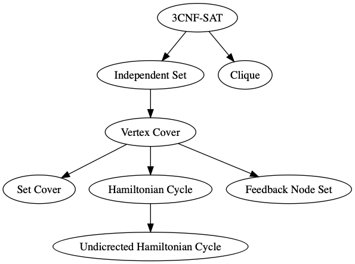

# Polynomial-Time Reductions in Isabelle/HOL
This repository sets out to formalize some classic results about NP-completeness in Isabelle/HOL. 

## Overview
The following reductions are currently formalized:

## Index
### Polynomial-Time Reductions
So far the following classic reductions between NP-hard problems have been formalized:
- `Three_Sat_To_Set_Cover.thy`: 3CNF-SAT <= Independent Set <= Vertex Cover <= Set Cover 
- `CNF_SAT_To_Clique.thy`: 3CNF-SAT <= Clique
- `HC_To_UHC.thy`: Hamiltonian Cycle <= Undicrected Hamiltonian Cycle
- `VC_To_FNS.thy`: Vertex Cover <= Feedback Node Set
- `VC_To_HC.thy`: Vertex Cover <= Hamiltonian Cycle

### Auxiliaries
- `VC_Set_To_VC_List.thy`: The representation of `Vertex Cover` using list makes the reduction from `Vertex Cover` to
  `Hamiltonian Cycle` easier. The rest of the repository uses the representation with sets.
- `List_Auxiliaries.thy` contains a definition of a sublist used to describe paths.
- `Graph_Auxiliaries.thy` and `Graph_Auxiliaries.thy` contain some basic lemmas used at different places.
- `Vwalk_Cycle.thy` contains a new definition of a cycle in a graph based on `vwalk`.
   The standard definition is based on `awalk`. 

## NREST
For reasoning about the runtime complexity of the reductions, we use: https://github.com/maxhaslbeck/NREST.