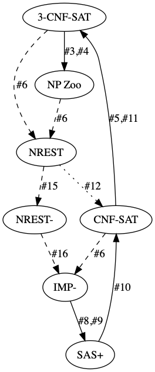

# Work Plan

Our current final goal is to finish Karp's 21 reductions and to put them on top of the Cook-Levin theorem.
Here is a visualization including the issues that we currently track.


The project essentially falls apart into the upper and lower half of this graph.
This is reflected in the two separate project milestones on Github.

Some of the following notes are also dispersed in the issues.

## WHILET

We plan to use a slightly stripped-down version of the language `IMP` found in the Isabelle distribution
as our computation model.
The main differences are that arithmetic expressions cannot be nested and that Boolean expressions are limited
to comparison against 0.

### IMP- Features

```
r=a+b
r=a*b
r=<const>
if r!=0 then <cmd> else  <cmd>, 
while (r!=0) <cmd>
 <cmd>;  <cmd>
skip
```

The looping construct is useful because we can always add a compilation step that unravels a more complex Boolean condition in the while-loop beforehand.

### Properties

- Can only work on a finite amount of unbounded natural number registers. Could also be integers (yet to be determined).
- Deterministic: this is fine for a definition of NP based on certificates.
- If a polynomial bound is given on the number of computation steps that the program will be executed, then the **sizes** (number of bits) of the registers can only grow polynomially in the input size.
- It is actually quite similar to the WHILE-language used in courses on theory of computation, cf. sec 5.4 of ["Theo" course @TUM](http://www21.in.tum.de/teaching/theo/SS20/folien-handout.pdf) 

## Translation from NREST to NREST-

`NREST` is the language in which we currently phrase our reductions.
As a first step, we want to reduce that to a variant `NREST-` that uses only a strongly restricted subset of `NREST`.
These should be basic control flow constructs similar to the ones supported by `IMP'` and arithmetic operations need to be limited to `+` and `*`.
To achieve the latter, we need a "compilation" step from (countable, nested) types to natural numbers (or integers).
At the very minimum this should support pairs and lists of numbers.
We can potentially use the type class mechanism from Imperative HOL as a blueprint. 
With that, the rest of the translation should be "easy" relying on parametricity.

Proof obligations:

- Functional refinement
- Polynomial time-bound is preserved. This seems a bit non-trivial because a "currency exchange" will be involved for arithmetic operations. Furthermore a single arithmetic operation might be replaced by multiple different ones (in Gödelization).
- "Internal" proof obligation: a polynomial bound on variables needs to preserved everywhere to get polynomial bounds on the projection functions used in Gödelization (see below).

Here is a rough example of such a Gödelization:
```
enc: 'a list -> nat
dec: nat -> 'a list

xs' <- 5#xs

Gödelized:
xs' <- enc(5) #' enc(xs)

#' now needs to be encoded as a sequence of arithmetic operations.
```
The concrete Gödelization can now be achieved by means of a pairing function (with corresponding projections).
Some pointers:

- https://en.wikipedia.org/wiki/Pairing_function
- http://szudzik.com/ElegantPairing.pdf

A difficulty is that the pairing functions referenced above would always require to run a primitively recursive program for projection.
The runtime bound for it will however be polynomial.

Questions:

- Is the monadic WHILE-construct compiled away in the next step, or in this step, or should we even introduce another step? Our current answer is probably the third option, exploiting the simplifier, for instance.
- How much can we reuse from the existing refinement frameworks?
- Which pairing function is "easiest" to work with?

## Translation from NREST- to IMP-

This step&mdash;moving from a shallow to a deep embedding&mdash;essentially corresponds to "pretty-printing" because all language constructs operations are more or less in a one-to-one correspondence.
Thus this step should be implemented by an automatic, proof-producing procedure.

Proof obligations:

- Functional refinement
- Polynomial time bound in the input is preserved (time refinement). The computation time should be measured in the number of arithmetic operations and control flow constructs (?).

Questions:

- How much can we reuse from the existing refinement frameworks or Lars Hupel's work?

## Translation from IMP- to SAS+

In this step, we will need to rely on the existence of polynomial bounds to generate a finite transition system from a given `IMP-` input program.
We get a polynomial bound for the number of computation steps in the input size from to the definition of NP.
We then prove that the sizes of the numbers stored in registers are also polynomially bounded.
This allows us to apply a technique like bit-blasting to translate the arithmetic operations on registers.

Proof obligations:

- Functional correctness of the translation
- Polynomial size bound on the transition system

Questions:

- Should Turing machines be an intermediate translation step?